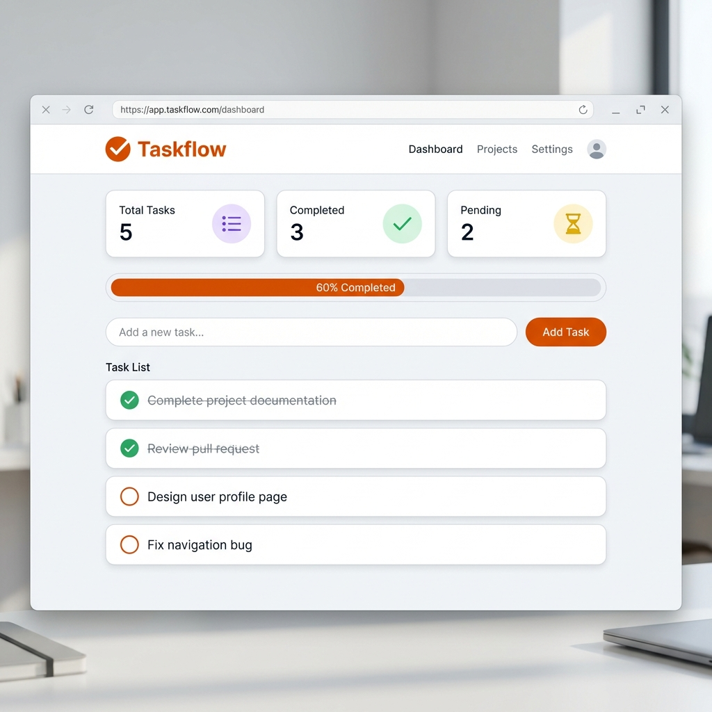

# Taskflow

Taskflow is a modern, responsive To-Do application designed to help you organize your daily tasks efficiently. Built with standard web technologies and powered by Firebase, it offers real-time synchronization and secure user authentication.

[](https://pranay08-bit.github.io/APPAG/)

 
*(Note: Replace with actual screenshot if available)*

## Features

- **User Authentication**: Secure sign-up and login using Email/Password and Google Sign-In.
- **Real-Time Database**: Tasks are synced instantly across devices using Cloud Firestore.
- **Smart Filtering**: easily filter tasks by "All", "Active", and "Completed" states.
- **Progress Tracking**: Visual progress bar and statistics to keep you motivated.
- **Responsive Design**: Works seamlessly on desktops, tablets, and mobile devices.
- **Clean UI**: A polished, user-friendly interface with modern aesthetics.

## Technologies Used

- **Frontend**: HTML5, CSS3, JavaScript (ES6+)
- **Backend (BaaS)**: Firebase (Authentication, Cloud Firestore)
- **Deployment**: Local serving / GitHub Pages (Optional)

## Getting Started

To run this project locally, follow these steps:

### Prerequisites

- A modern web browser (Chrome, Firefox, Edge, etc.)
- A code editor (VS Code recommended)
- (Optional) Node.js and NPM for running a local server easily

### Installation

1.  **Clone the repository**:
    ```bash
    git clone https://github.com/pranay08-bit/APPAG.git
    cd APPAG
    ```

2.  **Configuration**:
    - The project comes with a per-configured Firebase setup in `script.js`.
    - If you wish to use your own Firebase project, update the `firebaseConfig` object in `script.js` with your own credentials.

3.  **Run the Application**:
    - **Using VS Code Live Server**: Open `index.html` with Live Server.
    - **Using Python**:
      ```bash
      python -m http.server
      ```
    - **Using Node.js**:
      ```bash
      npx http-server .
      ```

4.  **Open in Browser**:
    - Navigate to `http://localhost:8000` (or the port shown in your terminal).

## Usage

1.  **Sign Up/Login**: Create an account or log in with Google to start saving your tasks.
2.  **Add Tasks**: Type your task in the input field and press Enter or click "Add Task".
3.  **Manage**: Click the checkbox to mark as complete, or the trash icon to delete.
4.  **Filter**: Use the tabs to view specific task lists.

## Deployment

This app is ready for deployment on static hosting services like GitHub Pages or Firebase Hosting.

### Important: Firebase Authentication
If you deploy this app to a live URL (e.g., `your-username.github.io`), you **MUST** add that domain to your Firebase Authorized Domains list:

1.  Go to the [Firebase Console](https://console.firebase.google.com/).
2.  Select your project.
3.  Navigate to **Authentication** > **Settings** > **Authorized Domains**.
4.  Click **Add Domain**.
5.  Enter your app's domain (e.g., `pranay08-bit.github.io`).

If you don't do this, Google Sign-In and other auth features will fail.

## License

This project is open-source and available under the [MIT License](LICENSE).
